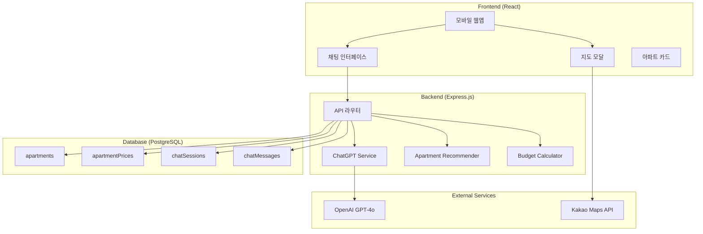
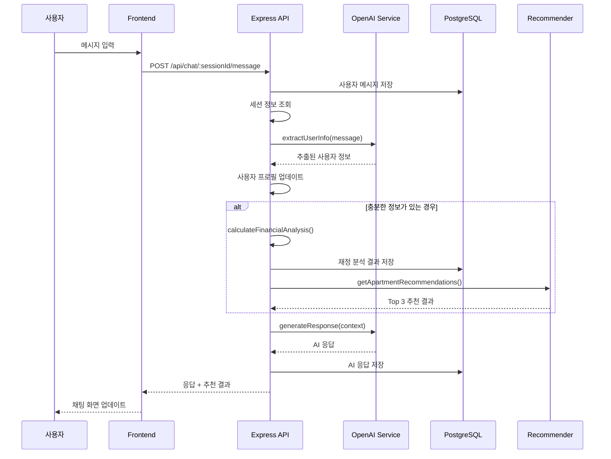
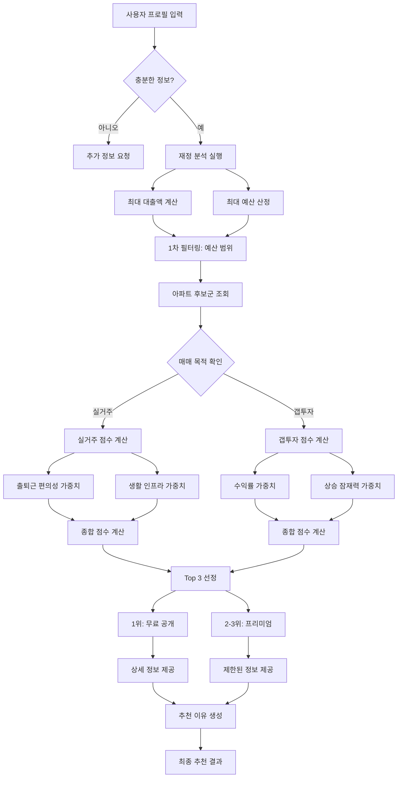
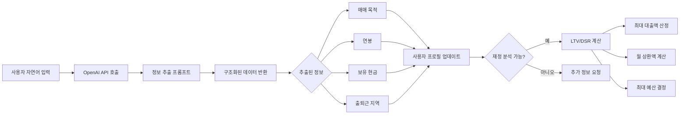
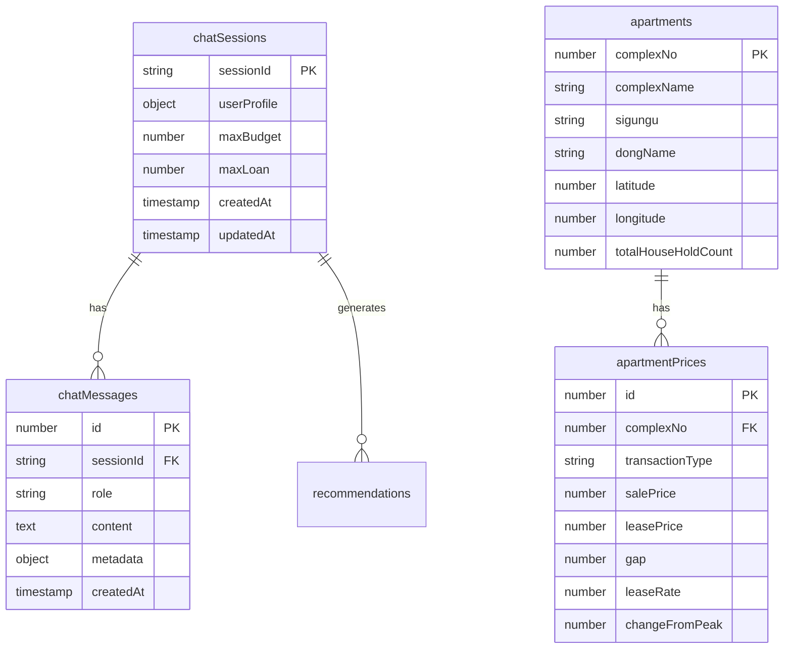
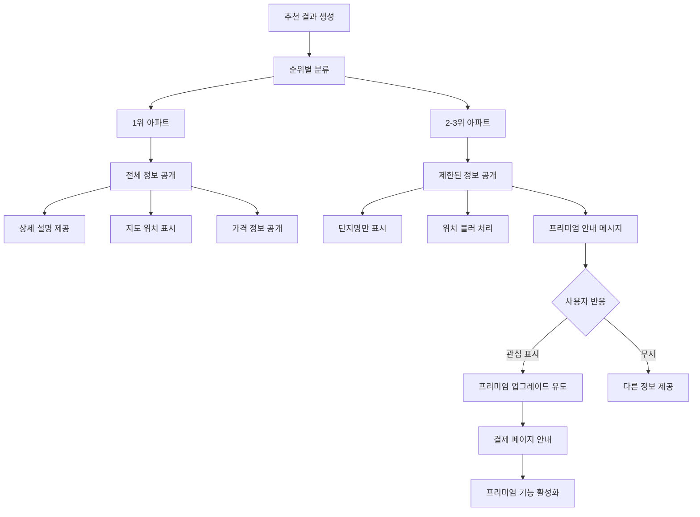
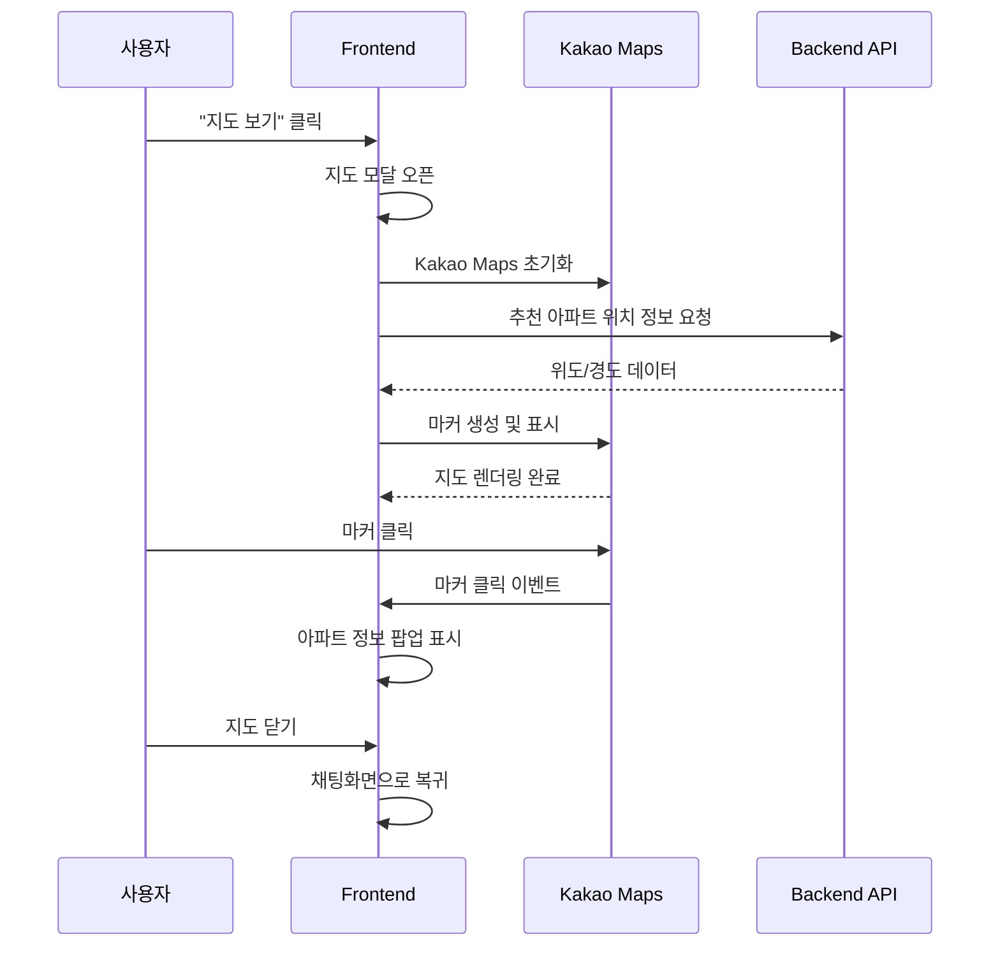
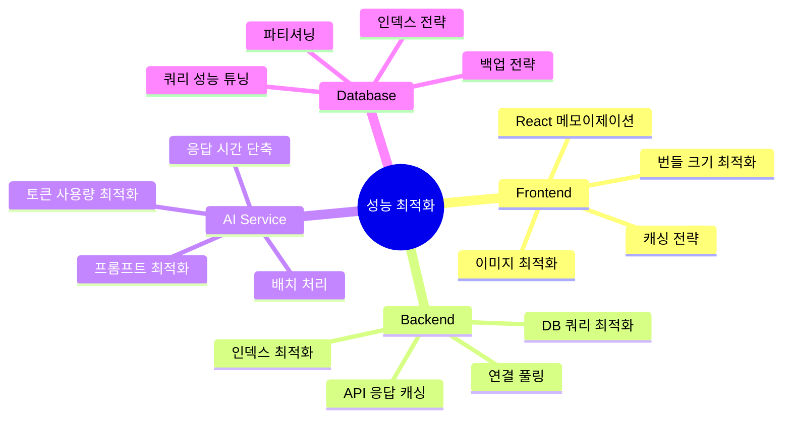

# 집사냥 AI 시스템 워크플로우 다이어그램

## 1. 전체 시스템 아키텍처

## 2. 채팅 메시지 처리 워크플로우

## 3. 아파트 추천 알고리즘 상세 워크플로우

## 4. 정보 추출 및 분석 프로세스

## 5. 데이터베이스 상호작용 다이어그램

## 6. 프리미엄 기능 워크플로우

## 7. 지도 연동 워크플로우

## 8. 성능 최적화 포인트

이 다이어그램들은 현재 구현된 시스템의 실제 워크플로우를 상세히 보여줍니다. Dify 대신 직접 OpenAI API를 연동하고, 자체 개발한 필터링 및 추천 알고리즘을 사용하는 현재 아키텍처를 정확히 반영했습니다.
